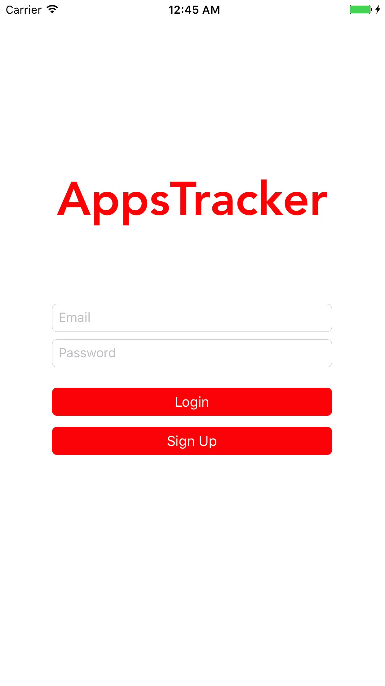
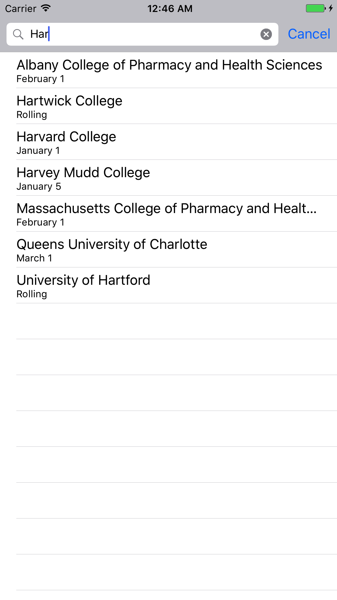
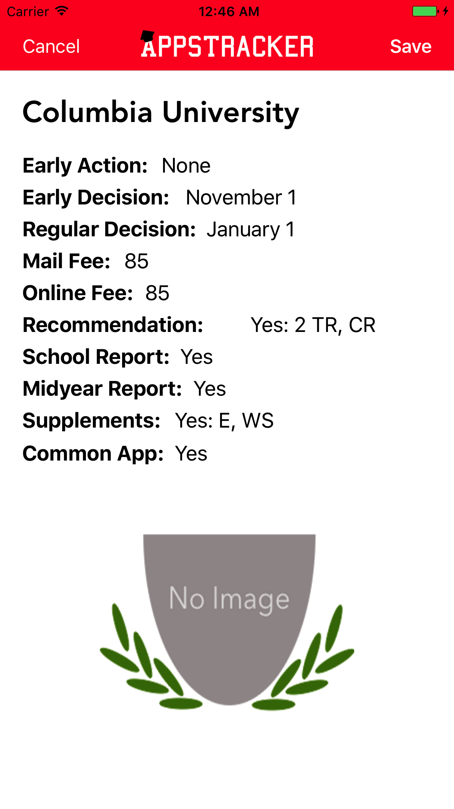
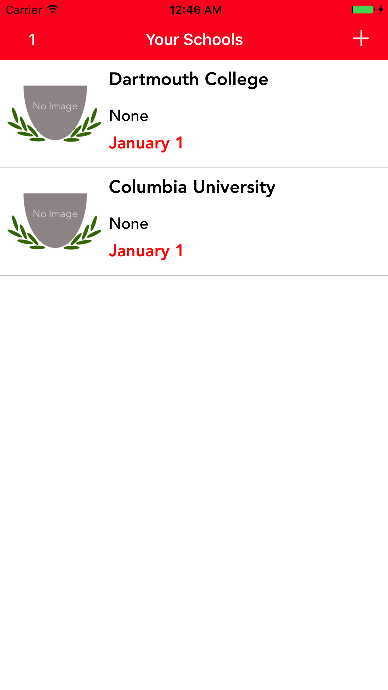
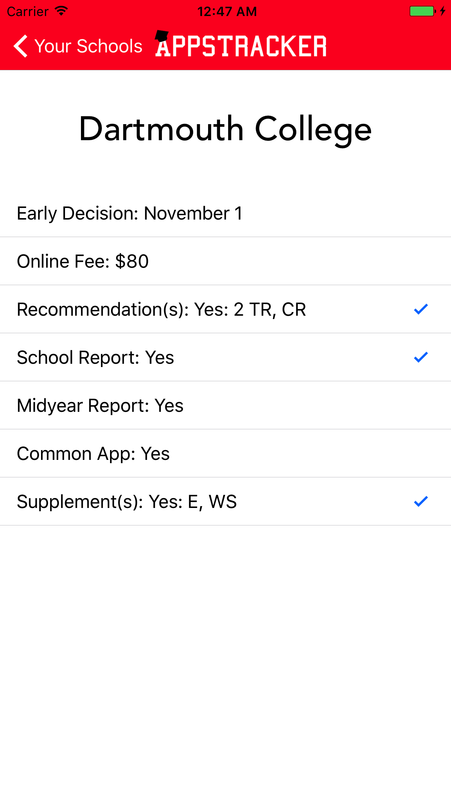

# AppsTracker

### Background
As a college applications consultant at a college applications consulting firm, I realized that many students applying to college
are unaware of the deadlines and requirements for the schools they are applying to and in some cases, can be discouraged by the 
overwhelming amount of requirements and not know where to start. AppsTracker is the solution.

### Features
AppsTracker is an app that allows users to track their college applications, including deadlines and requirements for each school.
Users can choose a college from a list of schools and see all of the requirements and deadlines in order to submit an application to
that school. There are over 600 schools included in AppsTracker's database, both Common Application and non-Common Application schools.

### How AppsTracker was built
AppsTracker is built using Firebase, an online database (among other things) platform created by Google. The information on the schools
included in the AppsTracker Firebase database was obtained by web scraping. 

### What's next?
**This app is currently in progress!**

Fix the login system.

Add more schools to the database.

Add the ability to add images to the school view or to have preloaded images in the database.

Implement a notification system.

### Installation

`pod install` in AppsTracker's directory.

`AppsTracker.xcworkspace` should be used.

